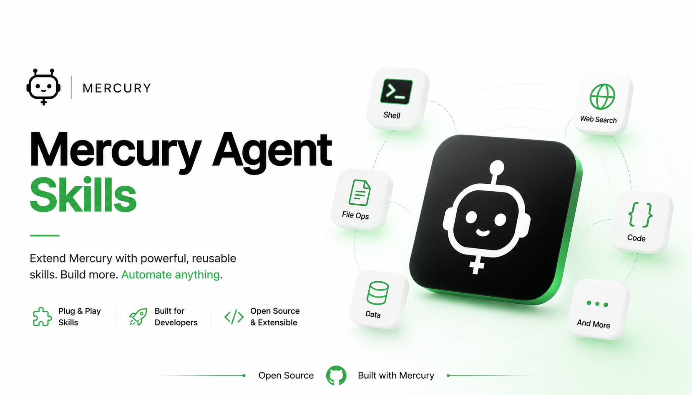

# Mercury Skills 🪐

> **✨ 本仓库新增**（Mayx07 贡献）：
> - [GBrain Lite](./categories/ai-ml/gbrain-lite/SKILL.md) — AI Agent 轻量知识库，markdown + YAML frontmatter + 全文搜索 + 交叉引用
> - [Daily Briefing](./categories/automation/daily-briefing/SKILL.md) — 每日 AI 语音播报，多源采集 → 知识库去重 → AI 整理 → TTS 合成
>
> 两个技能均含评分量表和踩坑记录，已在 Hermes Agent 生产环境验证。

<p align="center">
  
</p>

<p align="center">
  <a href="https://mercury.cosmicstack.org"><strong>🌐 Website</strong></a> •
  <a href="https://github.com/cosmicstack-labs/mercury-agent"><strong>🤖 Mercury Agent</strong></a> •
  <a href="./CATALOG.md"><strong>📖 Skill Catalog</strong></a>
</p>

**A curated collection of 130+ reusable AI agent skills — installable, composable, and built for [Mercury](https://mercury.cosmicstack.org) and beyond.**

Mercury Skills is an open library of `SKILL.md` playbooks designed for AI coding agents. Whether you use [Mercury Agent](https://github.com/cosmicstack-labs/mercury-agent), Claude Code, Cursor, Codex CLI, Gemini CLI, or any other agent-compatible tool — these skills give your AI structured expertise on demand.

**130+ skills across 20 categories** — from development and DevOps to health, career, and education. Every skill is hand-crafted, production-ready, and universally compatible.

## Why Mercury Skills?

| Feature | Description |
|---------|-------------|
| **Curated, not crowded** | Every skill is hand-crafted with real workflows in mind |
| **Universal format** | Works with any agent that understands `SKILL.md` |
| **Category-organized** | 12+ categories — find what you need fast |
| **Copy-paste or clone** | Install a single skill or the whole library |
| **Open source** | MIT licensed, community contributions welcome |

## Quick Start

### Option 1: Clone the whole library
```bash
git clone https://github.com/cosmicstack-labs/mercury-skills.git
```

### Option 2: Copy a single skill
Pick a skill from [CATALOG.md](./CATALOG.md) and copy its `SKILL.md` into your agent's skills directory:
```bash
cp mercury-skills/categories/development/clean-code/SKILL.md .mercury/skills/
```

### Option 3: Use with any agent
- **Mercury**: Drop into `~/.mercury/skills/` or your project's skills folder
- **Claude Code**: Drop into `.claude/skills/`
- **Cursor**: Drop into `.cursor/skills/`
- **Codex CLI**: Drop into `.codex/skills/`
- **Gemini CLI**: Drop into `.gemini/skills/`

## Categories

| Category | Skills | Description |
|----------|--------|-------------|
| [Development](./categories/development/) | 9 | Clean code, code review, debugging, testing, ADRs, documentation, refactoring, dependency management |
| [Frontend](./categories/frontend/) | 8 | React, Next.js, Tailwind, state management, testing, performance, responsive design, component systems |
| [Backend](./categories/backend/) | 9 | APIs, Node.js, Python, database design, auth, serverless, microservices, caching, message queues |
| [DevOps](./categories/devops/) | 9 | Docker, CI/CD, Kubernetes, Terraform, monitoring, cloud architecture, SRE, release management, GitOps |
| [AI & ML](./categories/ai-ml/) | 10 | AI agents, prompt engineering, agent health, memory, delegation, handoffs, token budgets, error recovery, audit logging |
| [Security](./categories/security/) | 7 | Audit, secure coding, threat modeling, API security, cloud security, supply chain, IAM |
| [Product](./categories/product/) | 7 | Strategy, research, discovery, experimentation, metrics, roadmapping, GTM |
| [Marketing](./categories/marketing/) | 8 | SEO, content, local business, social media, email, paid ads, brand strategy, content distribution |
| [Design](./categories/design/) | 7 | UI systems, accessibility, UX research, prototyping, design thinking, visual design, motion |
| [Business](./categories/business/) | 7 | Negotiation, startup strategy, financial modeling, sales, operations, hiring, fundraising |
| [Automation](./categories/automation/) | 8 | Workflows, shell scripting, web scraping, X/Twitter automation, test automation, data sync, deployment, RPA |
| [Data](./categories/data/) | 7 | Pipelines, SQL optimization, data modeling, visualization, warehousing, governance, streaming |
| [Mobile](./categories/mobile/) | 5 | iOS, Android, React Native, performance, App Store optimization |
| [Testing & QA](./categories/testing-qa/) | 5 | Test strategy, E2E, performance testing, API testing, accessibility testing |
| [Shop & Restaurant](./categories/shop-restaurant/) | 8 | Inventory, menu engineering, scheduling, reviews, daily pulse, table management, pricing, social |
| [Creative & Personal Development](./categories/creative-personal-development/) | 8 | Storytelling, decisions, standups, notes, repurposing, branding, validation, time blocking |
| [Career](./categories/career/) | 5 | Resume writing, interview prep, career planning, LinkedIn, salary negotiation |
| [Finance & Legal](./categories/finance-legal/) | 5 | Financial analysis, budgeting, contracts, privacy compliance, risk management |
| [Health & Wellness](./categories/health-wellness/) | 5 | Fitness, nutrition, mental health, sleep, habits |
| [Education & Learning](./categories/education-learning/) | 5 | Curriculum design, learning science, teaching methods, assessment, micro-learning |

## Skill Structure

Every skill follows this standard format:

```yaml
---
name: skill-name
description: 'What this skill does and when to use it'
metadata:
  author: cosmicstack-labs
  version: 1.0.0
  category: development
  tags: [clean-code, refactoring, best-practices]
---

# Skill Name

Full instructions, frameworks, scoring rubrics, and actionable guidance.
```

## Browse Skills

➡️ [Full Catalog → CATALOG.md](./CATALOG.md) — **130+ skills across 20 categories**

## Try Mercury Agent

[Mercury](https://mercury.cosmicstack.org) is the soul-driven AI agent these skills were built for. It features:

- 🧠 **Second Brain** — Persistent memory that learns from every conversation
- 🔧 **Skill System** — Load skills like these to gain instant expertise
- 🔐 **Permission Guardrails** — Safe by design, auditable by default
- 📊 **Token Budgets** — Stay in control of your AI usage costs
- 📱 **Multi-Channel** — CLI, Telegram, or web — same agent everywhere

```bash
# Install Mercury Agent
npm install -g @cosmicstack/mercury-agent

# Use a skill
mercury --skill categories/ai-ml/prompt-engineering/SKILL.md
```

> **[Get Started with Mercury →](https://mercury.cosmicstack.org/docs)**

## The Cosmic Stack Ecosystem

| Project | Description |
|---------|-------------|
| [Mercury Agent](https://github.com/cosmicstack-labs/mercury-agent) | Soul-driven AI agent with Second Brain, skills, and guardrails |
| [Mercury Skills](https://github.com/cosmicstack-labs/mercury-skills) | 📍 You are here — reusable skill library for any AI agent |
| [Battlefield](https://github.com/hotheadhacker/battlefield) | Agentic platform for task orchestration |

## Contributing

See [CONTRIBUTING.md](./CONTRIBUTING.md) for guidelines on creating and submitting skills.

## License

MIT — see [LICENSE](./LICENSE)

---

<p align="center">
  <sub>Built with ❤️ by <a href="https://cosmicstack.org">Cosmic Stack</a></sub>
</p>
